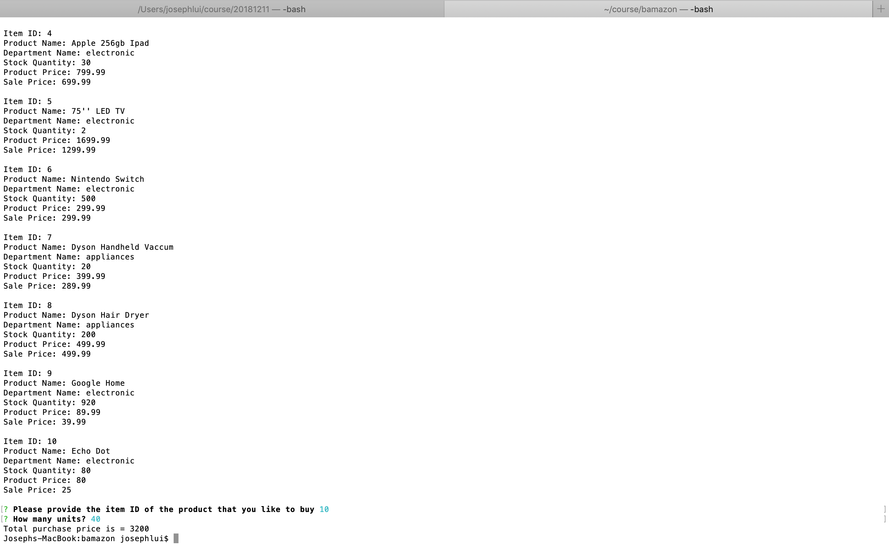
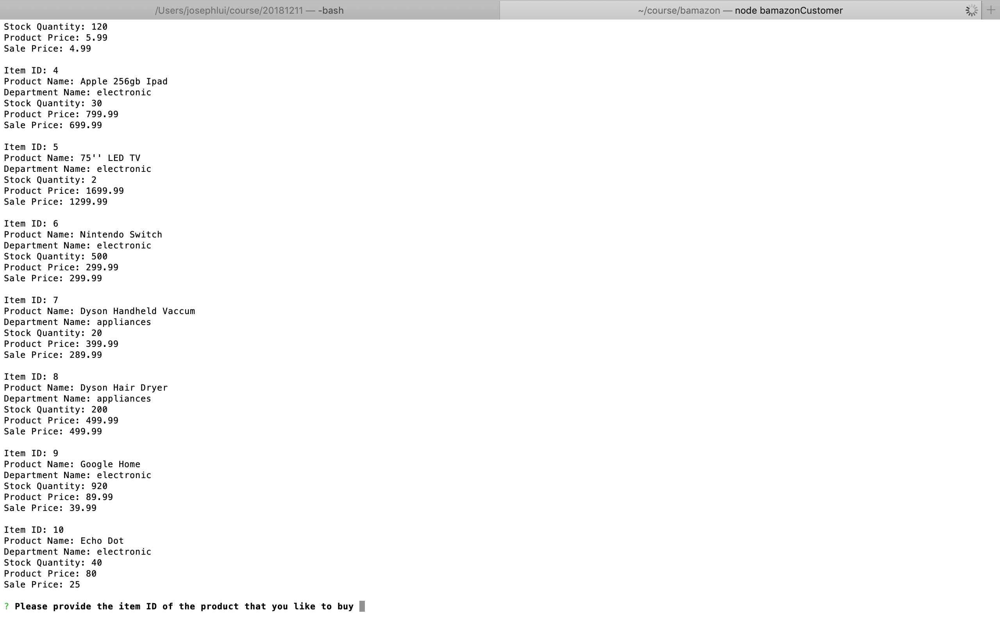
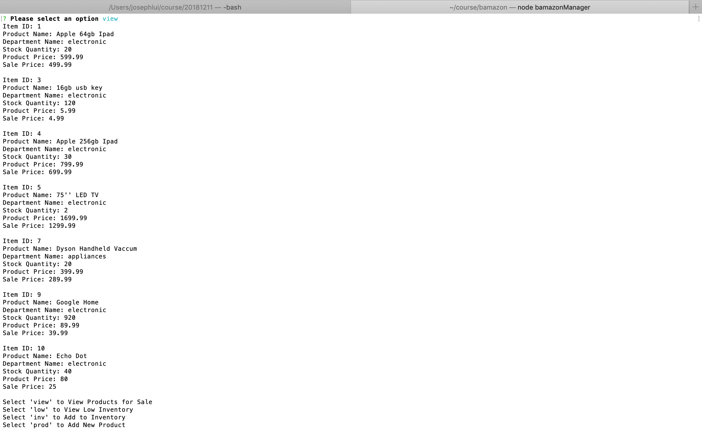
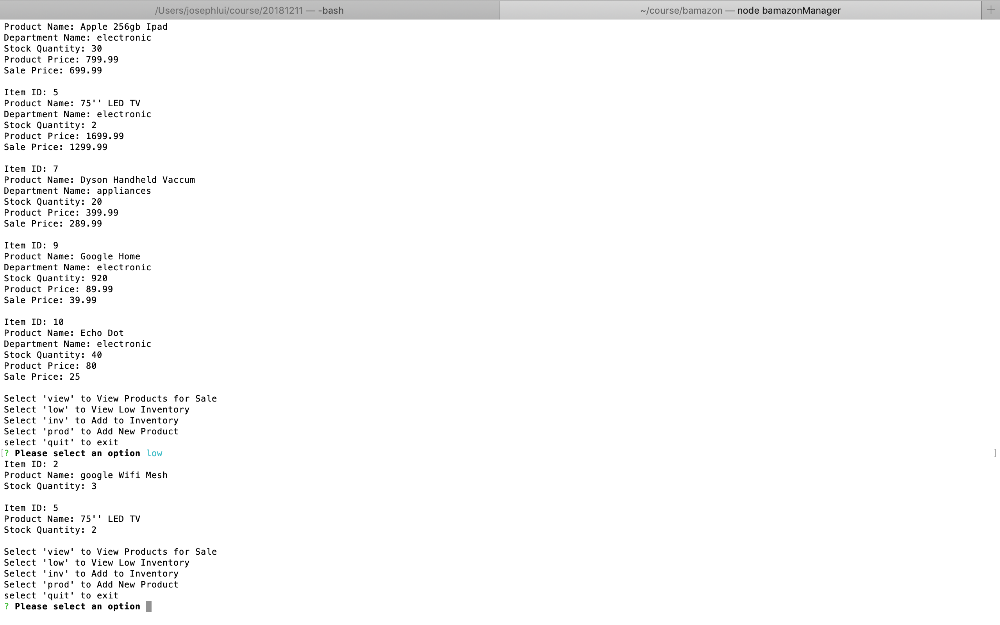
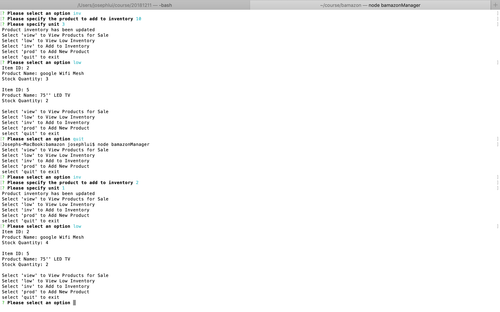
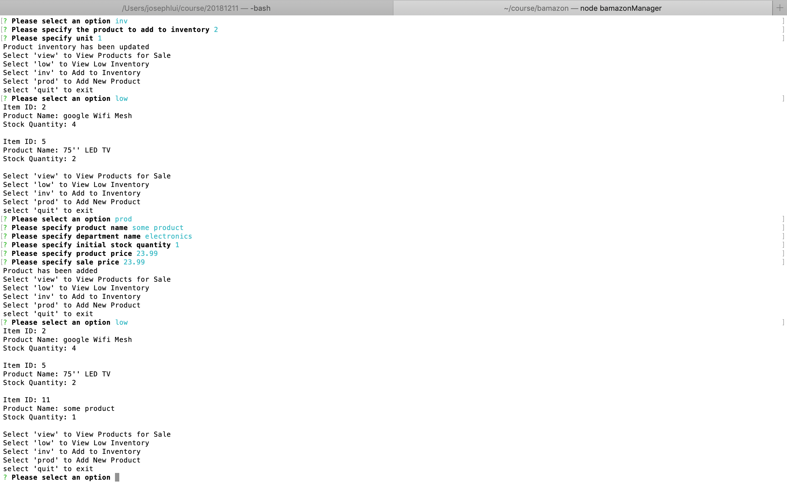

# bamazon

bamazon is a Node inventory app.  The users can interact with the console to purchase products, add product to inventory, add new product, and determine product inventory in the database.

## Getting Started

The quickest way to get started is to download the repo and run the following commands to start the app.

node bamazonCustomer  
node bamazonManager  

### Prerequisites

In order to use the application, you will need MySql installed locally or remotely depending on where you are deploying the application.  Once the database is setup, you can run 'Schema.sql' to setup the database schema and run bAmazon.sql to populate the product table.

### Installing

1)  Clone the repository
2)  Populate the database configuration in the .env file
3)  Run the following command to display all the product and inventory in the database:
    node bamazonCustomer  
    You will then be presented with a command prompt to make purchases based on the products in the inventory.
    
    If you try to purchase a product with quantity more than what is available in the database, the system rejects the purchase.  
    
    Once your purchase has been accepted, the system displays the cost of the purchase.
    

4)  Alternatively, you can run the following command to view product inventory, add product to inventory, add product, and view product for sale.
 
View Products for Sale 
 
View Products Low In Inventory  
 
Add To Inventory  
 
Add New Product  
 

## Running the tests

N/A

### Break down into end to end tests

N/A

### And coding style tests

N/A

## Deployment

N/A

## Built With

N/A

## Contributing

N/A

## Versioning

N/A

## Authors

* **Joseph Lui** - *Initial work*